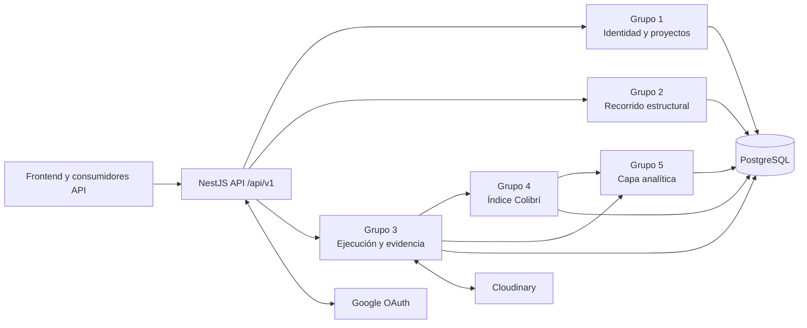

# Arquitectura de Colibrí OS

## Propósito y alcance

Colibrí OS organiza el recorrido emprendedor en cinco capas: identidad, estructura curricular, ejecución respaldada por evidencia, reputación y analítica. Esta arquitectura se basa en los documentos oficiales **Grupo 1: Identidad y Roles**, **Grupo 2: Núcleo Estructural**, **Grupo 3: El Vuelo (ejecución y evidencia)**, **Grupo 4: Capa Reputacional / Índice Colibrí** y **Grupo 5: Capa Semántica / Analítica**.

La aplicación expone una API REST NestJS con prefijo `/api/v1`. PostgreSQL es el almacén transaccional; TypeORM mapea las entidades y Cloudinary conserva los archivos de evidencia. Google OAuth es un proveedor de identidad opcional.

## Capas y módulos

| Grupo | Responsabilidad | Módulos y entidades principales |
| --- | --- | --- |
| 1. Identidad y roles | Identifica usuarios, proyectos, equipos y activos NFT. | `users`, `projects`, `project-profile`, `project-members`, `nfts`: `User`, `Project`, `ProjectProfile`, `ProjectMember`, `NftProject`, `NftActor`, `MecenasNftPortfolio`, `NftOwnershipEvent`. |
| 2. Núcleo estructural | Define el mapa del recorrido: tramos, categorías, PACs, microacciones y recursos. | `tramos`, `categories`, `pacs`, `micro-action-definitions`, `learning-resource`: `Tramo`, `Category`, `Pac`, `MicroActionDefinition`, `LearningResource`, `ProjectPac`. |
| 3. Ejecución y evidencia | Registra trabajo realizado, archivos, evaluación y cierre de tramo. | `micro-action-instance`, `evidence`, `evaluation`, `execution`, `tramo-closure`, `digital-credentials`: `MicroActionInstance`, `Evidence`, `EvidenceVersion`, `Evaluation`, `EvaluationAiResult`, `EvaluationHumanReview`, `Rubric`, `TramoClosure`, `DigitalCredential`. |
| 4. Capa reputacional | Versiona el algoritmo del Índice Colibrí, guarda snapshots y explica sus contribuciones. | `reputation`: `IcAlgorithmVersion`, `ReputationIndexSnapshot`, `ReputationIndexExplanation`. |
| 5. Capa semántica / analítica | Consolidación temporal y semántica para dashboards y análisis longitudinal. | `analytics`: tablas `fact_*` y dimensiones `dim_*`, incluidas señales de actividad, evidencia, colaboración, sostenibilidad, competencias y skills. |

Los módulos `auth`, `cloudinary`, `hierarchy`, `curriculum` y `mecenas-semilla` completan funciones transversales de autenticación, almacenamiento, navegación del recorrido y participación de mecenas.

## Flujo principal de negocio

1. Un usuario se registra o inicia sesión mediante credenciales locales o Google OAuth.
2. El usuario crea o integra un proyecto, que se asocia a un tramo, categorías y PACs.
3. El emprendedor inicia una microacción, adjunta evidencia y la envía a evaluación.
4. La evidencia evaluada alimenta el cálculo del Índice Colibrí y sus explicaciones versionadas.
5. Las entidades analíticas consolidan señales y dimensiones para tableros, perfiles y análisis histórico.

## Componentes técnicos

| Componente | Implementación | Responsabilidad operativa |
| --- | --- | --- |
| API | NestJS 11 + TypeScript | Rutas REST, validación, serialización y Swagger. |
| Persistencia | PostgreSQL + TypeORM | Entidades de negocio, relaciones, migraciones y seeds. |
| Autenticación | Passport, JWT y Google OAuth | Emisión y validación de tokens; OAuth con Google. |
| Autorización | `JwtAuthGuard`, `RolesGuard`, `@Roles()` | Protección por autenticación y rol donde se declara el guard correspondiente. Ver la [matriz de permisos](security/permissions-matrix.md). |
| Archivos | Cloudinary | Firma de cargas, consulta y eliminación de archivos de evidencia. |
| Documentación API | Swagger | UI en `/api/v1/docs` cuando `SWAGGER_ENABLED=true`. |
| Entrega | GitHub Actions + Render | CI compila el backend y, ante éxito en `main`, el workflow de despliegue invoca el hook de Render. |

## Convenciones de API

- Prefijo global: `/api/v1`.
- Formato de autenticación: `Authorization: Bearer <JWT>` en rutas protegidas.
- Validación: se aplica `ValidationPipe` global con `whitelist`, `forbidNonWhitelisted` y transformación de tipos.
- CORS: se permite el origen indicado en `FRONTEND_URL`.
- Documentación interactiva: `/api/v1/docs` cuando Swagger está habilitado.

## Decisiones de documentación

- La especificación OpenAPI de Swagger describe contratos de endpoints y DTOs; este documento explica relaciones y responsabilidades entre módulos.
- La fuente funcional del modelo son los cinco documentos detallados oficiales. Al modificar entidades o módulos, actualizar este documento y el README en el mismo cambio.
- Todo cambio de acceso debe actualizar la [matriz de permisos](security/permissions-matrix.md) y revisarse con backend y seguridad.
